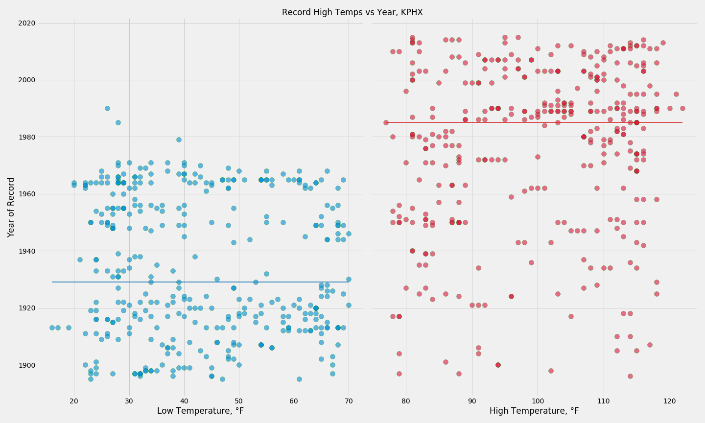
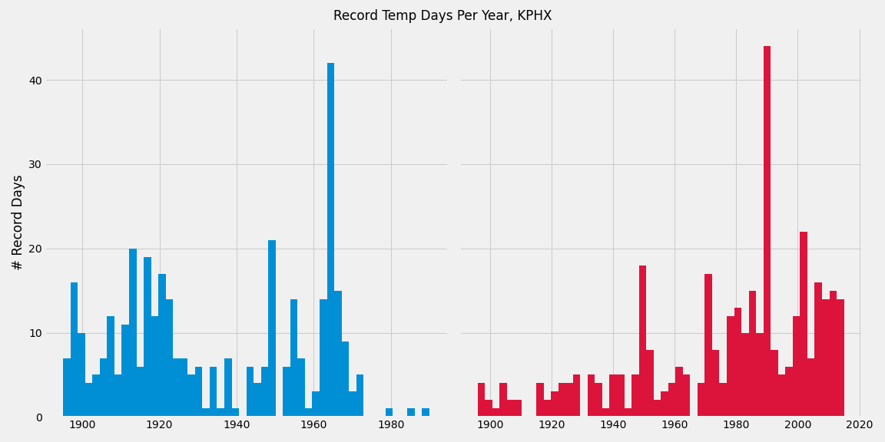
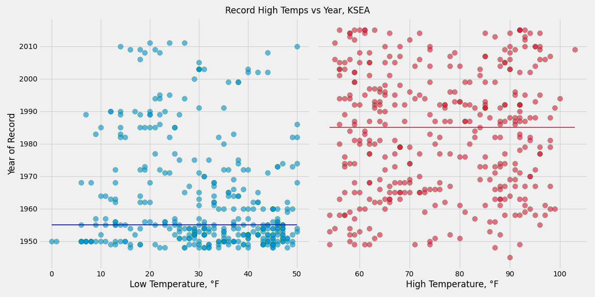
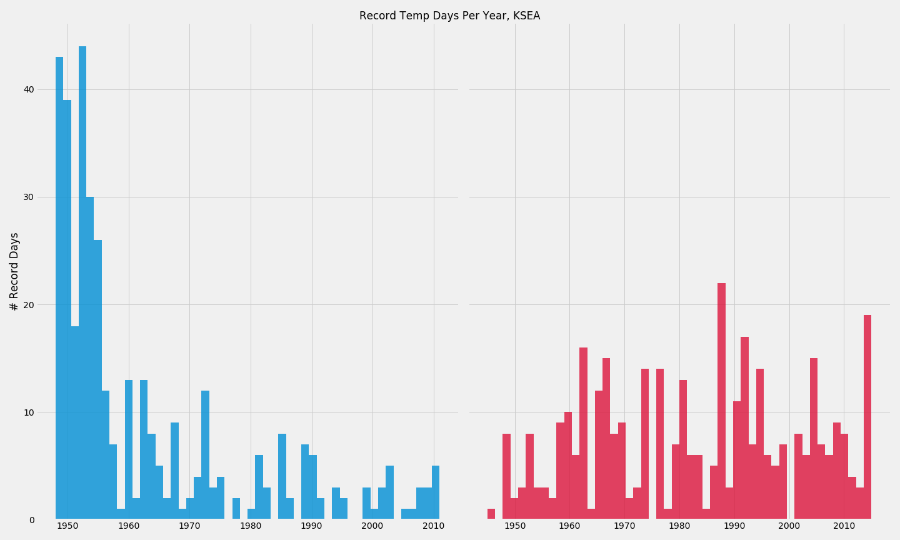
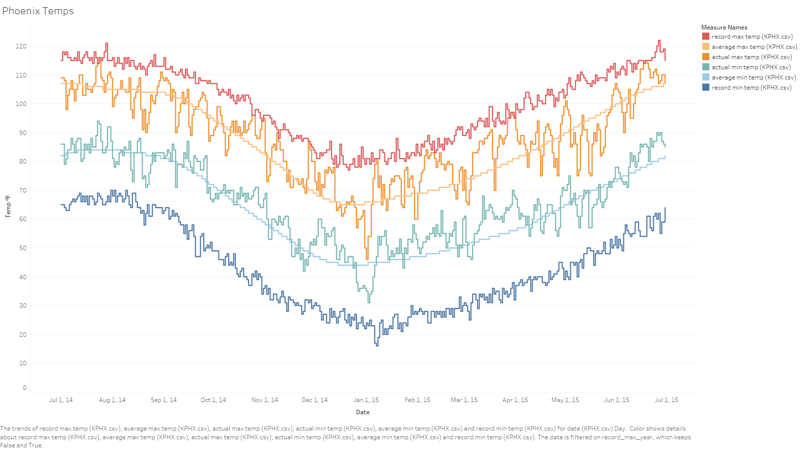
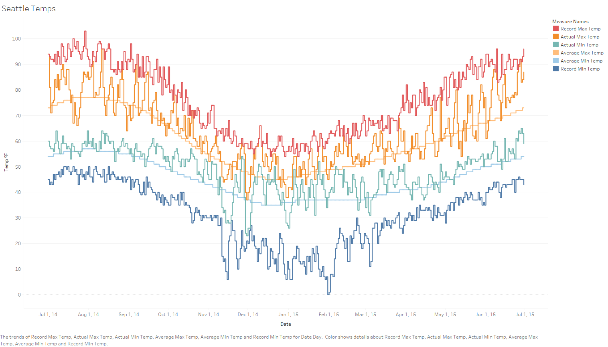

# Historical Temperature Trend & Records Analysis
## by Chris Sulfrian
12/2020

## Data Details

Data from FiveThirtyEight's open data repository:

https://github.com/fivethirtyeight/data/tree/master/us-weather-history

The data spans the one year period from July 1 2014 to June 30 2015. It includes the following data:
- actual min, max, and mean temperature
- average min, max, and mean temperature
- record min, max, and mean temperature
- the year the record min or max temperature occured
- actual, average, and record precipitation amounts

from the following cities:
- Charlotte, NC
- Houston, TX
- Jacksonville, FL
- New York, NY
- Phoenix, AZ
- Cincinatti, OH
- Indianapolis, IN
- Chicago, IL
- Philadelphia, PA
- Seattle, WA

## Goal

I wanted to explore the occurrence of record temperature days, both high and low. We're all familiar with the fact that the world is getting warmer overall, but how do record temperatures on individual days tie in with this? I'll be looking at Phoenix, AZ and Seattle, WA for this analysis.

### Phoenix, AZ

*Horizontal lines indicate the median year of record temp*

*Histograms of the years that record temps occurred*

Phoenix seems to be long past its days of record cold temperatures. There are some interesting spikes in both the record high and record low temperatures, though they are 20+ years apart. There is a fairly clear trend in the increasing occurrence of record highs.

### Seattle, WA

*Horizontal lines indicate the median year of record temp*

*Histograms of the years that record temps occurred*

In general Seattle's record lows are fading away in the past and while the record highs are more evenly distributed, it appears they are on an upward trend.

*Temperature trends in Phoenix*

Temperatures for this time period in Phoenix are generally above average - especially in the winter months - with 8 new record high temperatures throughout the year. The other interesting aspect is how high above the average minimum most of the low temperatures are.

*Temperature trends in Seattle*

Temperatures in Seattle are trending the same direction - above average. The high temperatures are even more frequently above average than in Phoenix, with __19__ new record high temperatures. The actual minimums are also well above average for the most part. 

## Conclusion

As we often hear, weather is not climate. The year that record temperatures occur vary widely depending on location, but there is a common trend: record lows happen more often in the first half of the 20th century while record highs are more likely to have been recorded in the second half. For this one year period both daily high and low temperatures are well above average. Phoenix has experienced no near-record lows during this time, but some record highs. Seattle did experience some near record cold weather, but more alarmingly it had many more record high days.

These data are 5 years old at this point, and each year that passes marks a new hottest year on record. All the information in this project is already out of date, and the records will likely have climbed.

## Further Exploration

The Wunderground scraping script is broken, as Wunderground has changed how their URLs are constructed. I would like to fix that, then scrape the site for numerous years to see how quickly the median record high temperature year is changing. Updating the data to include the past 5 years would be the next step. I would also like to track actual temperatures vs average highs and lows year-to-year.