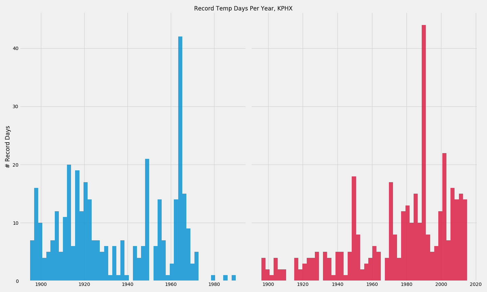
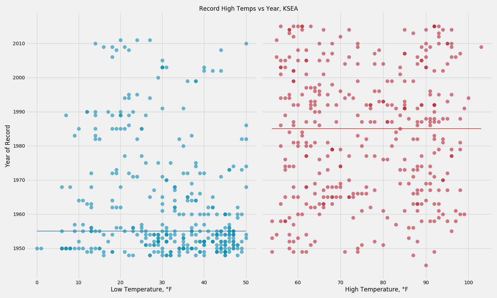

# Historical Temperature Trend Analysis
## by Chris Sulfrian
12/2020

Data from FiveThirtyEight's open data repository:

https://github.com/fivethirtyeight/data/tree/master/us-weather-history

## Data Details

The data spans the one year period from July 1 2014 to June 30 2015. It includes the following data:
- actual min, max, and mean temperature
- average min, max, and mean temperature
- record min, max, and mean temperature
- the year the record min or max temperature occured
- actual, average, and record precipitation amounts

from the following cities:
- Charlotte, NC
- Houston, TX
- Jacksonville, FL
- New York, NY
- Phoenix, AZ
- Cincinatti, OH
- Indianapolis, IN
- Chicago, IL
- Philadelphia, PA
- Seattle, WA

## Goal

I wanted to explore the occurrence of record temperature days, both high and low. We're all familiar with the fact that the world is getting warmer overall, but how do record temperatures on individual days tie in with this?

### Phoenix, AZ

*Horizontal lines indicate the median year of record temp*

*Histograms of the years that record temps occurred*

### Seattle, WA

*Horizontal lines indicate the median year of record temp*

*Histograms of the years that record temps occurred*

## Conclusion

As we often hear, weather is not climate. The year that record temperatures occur vary widely depending on location, but there is a common trend: record lows happen more often in the first half of the 20th century while record highs are more likely to have been recorded in the second half. 

## Further Exploration

It would be interesting to examine how quickly the median year of records changes. 